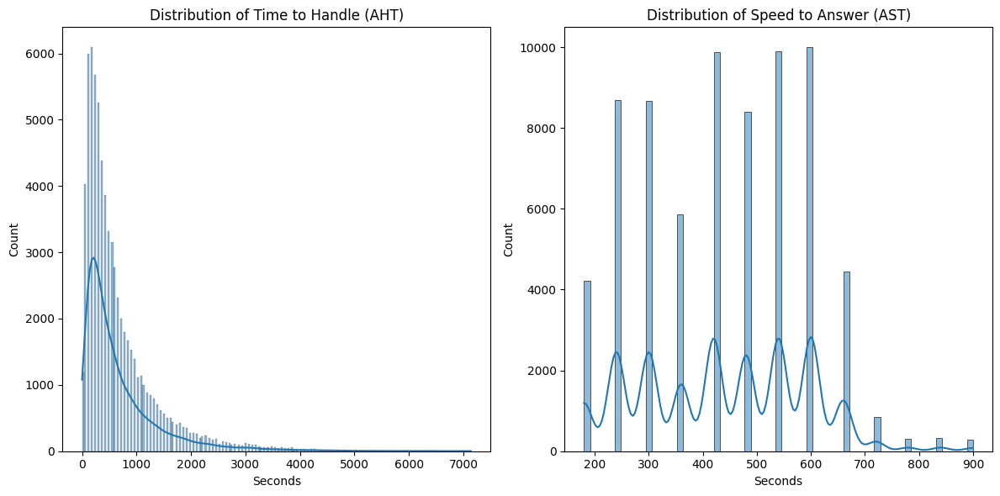
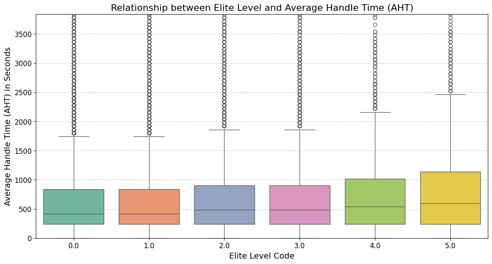
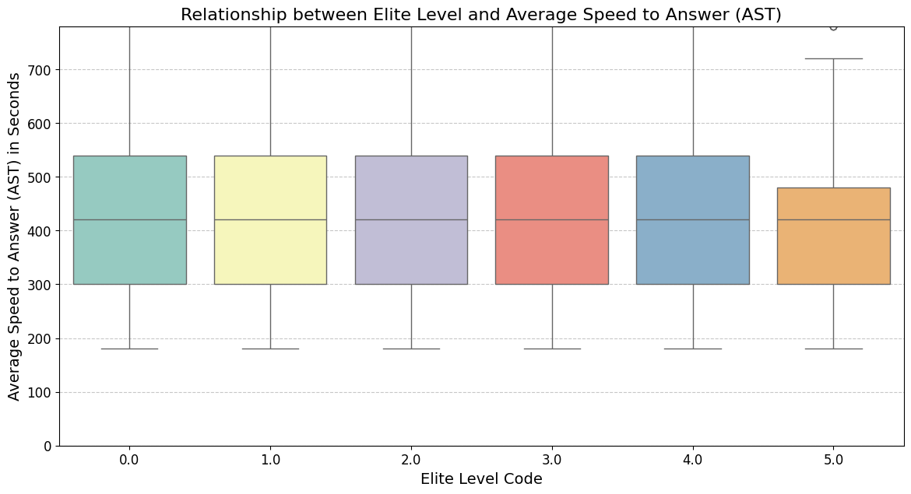
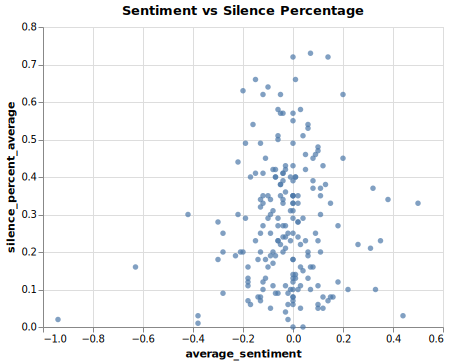
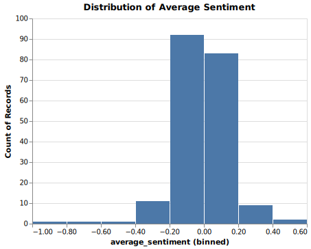
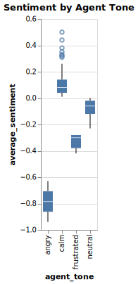
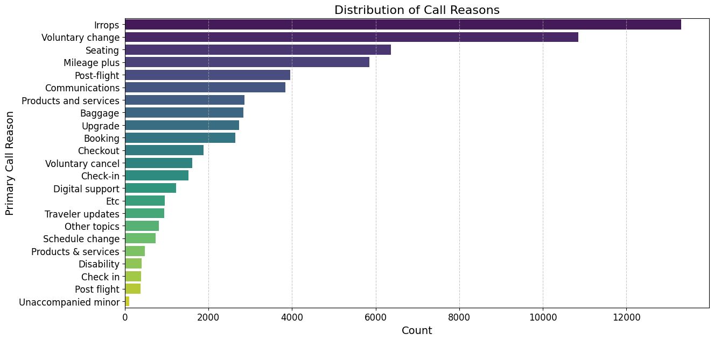
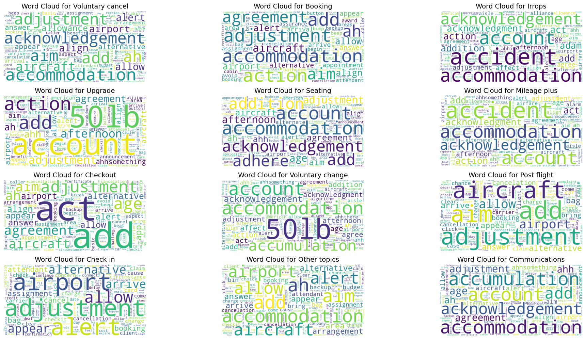
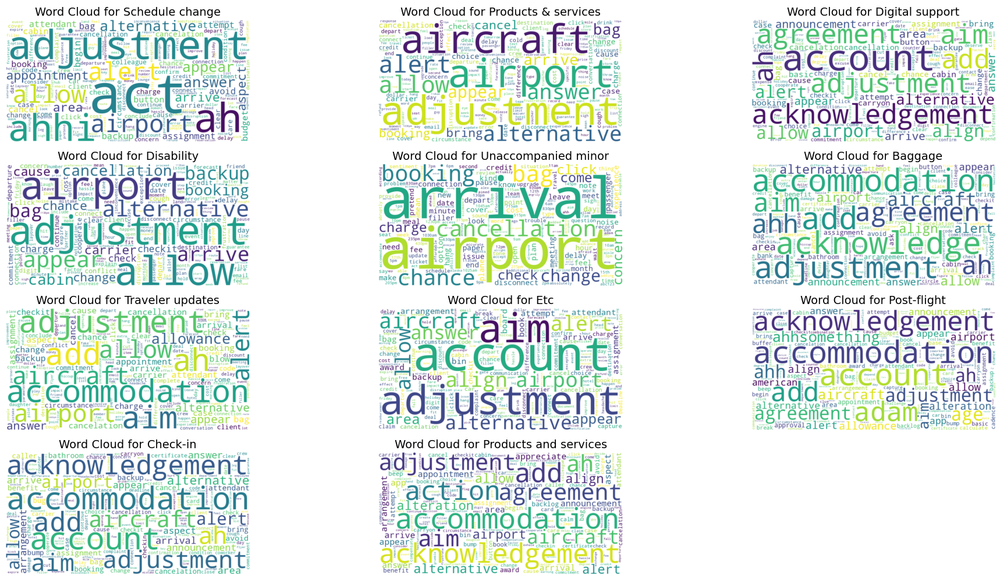

# United Airlines Call Center Optimization \& Prediction

- **Objective**: Improve Average Handle Time (AHT) and Average Speed to Answer
  (AST)
- **Focus**: Enhance customer satisfaction and operational efficiency

- Key Metrics
  - Average Handle Time (AHT): $\frac{\text{Total Handle Time}}{\text{Total Number of Calls}}$
  - Average Speed to Answer (AST): $\frac{\text{Total Waiting Time}}{\text{Total Number of Calls}}$

## Datasets Used

- **calls.csv**: Call details
- **customers.csv**: Customer information
- **reason.csv**: Call reasons
- **sentiment_statistics.csv**: Sentiment analysis
- **test.csv**: Test data for predictions

## Initial Data Exploration

- Loaded datasets using Pandas
- Displayed basic information about each dataset

```python
Calls Dataset:
Data columns (total 7 columns):
 #   Column                   Non-Null Count  Dtype 
---  ------                   --------------  ----- 
 0   call_id                  71810 non-null  int64 
 1   customer_id              71810 non-null  int64 
 2   agent_id                 71810 non-null  int64 
 3   call_start_datetime      71810 non-null  object
 4   agent_assigned_datetime  71810 non-null  object
 5   call_end_datetime        71810 non-null  object
 6   call_transcript          71810 non-null  object
dtypes: int64(3), object(4)

Customers Dataset:
RangeIndex: 71810 entries, 0 to 71809
Data columns (total 3 columns):
 #   Column            Non-Null Count  Dtype  
---  ------            --------------  -----  
 0   customer_id       71810 non-null  int64  
 1   customer_name     71810 non-null  object
```

## Analysis of Call Durations

- The **Average Handle Time (AHT)** for a call is
  $\approx 697.05\; \text{seconds}$.
- The **Average Speed to Answer (AST)** for a call is
  $\approx 437.07\; \text{seconds}$ .

{ width=75% }

# Analysis of Elite level of customers

- Had discrete values (NaN were filled with zeroes) `[0, 1, 2, 3, 4, 5]`
- Note the outliers

{width=50%}\ {width=50%}


## Analysis of Silence and Sentiment

- **Silence Percentage**: Average silence in calls is $\approx 0.29\%$

{width=40%} \ {width=40%} \ {width=15%}

## Categorizing Call Reasons

- Analyzed dataset to uncover patterns in call reasons
- Extracted the training data from the calls dataset
- Preprocessed the transcript data using stop word removal for LDA and Bigram analysis. Reason categories were normalized for feature identification.

{width=80%}

## Bigram Wordcloud

- Extracted and created a bigram wordcloud for each primary call reason

{width=90%}

## Bigram Wordcloud

{width=90%}

## Topic Modeling

- Used Latent Dirichlet Allocation (LDA) to identify topics in call transcripts
- Identify recurring problems that could be resolved via self-service options
- Preprocessed call transcripts and extracted key phrases using TF-IDF and NMF.
- Displayed the top words for each topic and mapped topics to primary call reasons.
- Identified recurring problems that could be resolved via self-service options.

```markdown
Topic 1:
looks like understand frustration agent understand customer ugh earlier flight let know let check customer hi today customer agent youre
Topic 2:
agent youre youre welcome looks like agent problem let look san francisco customer hi today customer im calling let pull
Topic 3:
looks like understand frustration agent youre today customer im sorry travel voucher customer yeah help today let know customer service
Topic 4:
change fee looks like agent youre youre welcome really appreciate let look let know rest day agent understand customer hi
...
```


## Recurring Problems

The following are the top words for each topic:

```markdown
Refund, Monday, Lost, Sunday, Voucher, Return, Frustration,
Dates, Class, Bag, Wanted, La, San, Sf, Hours, Day, Francisco, Thursday, Took,
Returning, Seat, Check, Friday, London, Missed, Aisle, Tonight, Date, York,
Schedule, Delay, Smith, Standby, Delays, 500, Upgrade, Tuesday, Denver, Seats,
Need, Days, Tomorrow, Instead, Fee, Earlier, Meeting, Economy, Work,
Confirmation, Experience, Saturday, Ugh, Checked, Row, Waive, Chicago, Booked,
Delivered, Baggage, Booking, Weather, Sir, New, Change, Time, Delayed, Luggage,
Bags, Reservation, Scheduled, Travel, Sfo, Following, Wednesday, Claim, Fare,
Forecast, 150, Double, American, Assignment, Legroom
```

## Reason Investigation

- Utilized Gemini-1.5-pro-preview to infer an actionable summary of call reasons
  for _each_ category
- Please refer to the detailed report in the submitted `reasons.md` file

```markdown
**Irrops Call Driver Analysis:** ...

Customers frequently contact support due to disruptions (Irrops) stemming from:

- **Flight Schedule Changes:**
- **Baggage Issues:**
- **Compensation and Refunds:** ...

**Recommended Actions:**

- **Proactive Communication:** Implement automated notifications for flight
  changes and delays with clear rebooking options.
- **Streamlined Rebooking:** Develop a user-friendly online rebooking system
  with flexible search options for alternative flights and seat selection. ...

...
```

# Model Predictions

## Predicting Primary Call Reasons

- Split into testing and training datasets
  ```python
  Training Data Shape: (66653, 10)
  Testing Data Shape: (5157, 9)
  ```

- We use the Meta Llama-3.2-1B Instruct Fine-Tuned model to predict primary call reasons
- Utilized a prompt-based approach for inference with refined conversation
  context for better predictions
- 5157 predictions with ~.45s/inference latency
- All of the training and inference was done on 2 notebooks on Kaggle with 2xT4 GPUs ran parallelly.
- Due to time constraints we are still in the process of fine-tuning the model on the training dataset.

# Recommendations

## Actionable Insights

- **Reduce AHT**: Streamline processes and improve agent training
- **Enhance IVR System**: Implement self-service options for recurring issues
- **Categorize Call Reasons**: Improve call routing and reduce manual tagging
  through automation using SOTA ML models.

## Further Investigation

- Explore additional data sources
- Conduct deeper sentiment analysis
- Implement finetuned models for better predictions

Please find the source code at **GitHub**: [github.com/KorigamiK/calls](https://github.com/KorigamiK/calls).

# Thank You!

